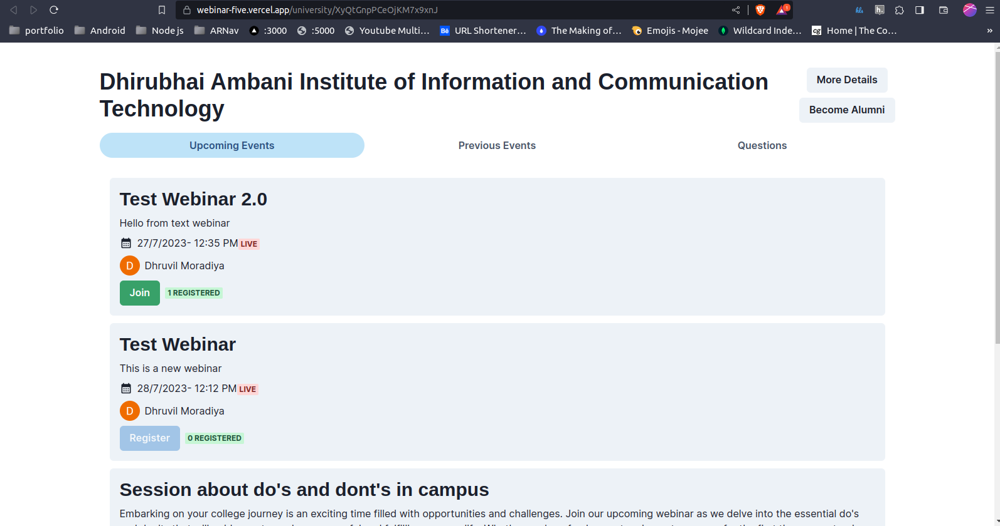

# Edu Sakha

This is a project which is made in Hackathon at DAIICT.

User flow is given below

theme : Edtech

Team Name: Team Perpendicular

Because it is hosted on free tier it will take some time after button clicks please wait for sometime

[Live Demo](https://webinar-five.vercel.app/)

## Main Features

- [x] Create University Details Page
- [x] Create University Home page (View Previous Webinar is pending)
- [x] Create webinar screen
- [x] Create Home Page
- [x] Only registerd students can enter the webinar
- [x] Create page for alumni to create webinars
- [x] Create page to become alumni
- [x] Create page for alumni to view their created webinars
- [x] Students can't register after webinar is live
- [x] Only registered stuednts can create webinar
- [x] Registered Students will see join button if webinar is started
- [ ] Email Alarms
- [ ] Make Search Work
- [ ] Create Question Section so that students can ask questions and alumni can answer their questions.

### User Flow

Members :

- Dhruvil Moradiya
- Harsh Jani
- Harshil Joshi

Tech Stack :

- Next JS
- React JS
- Firebase
- Chakra UI
